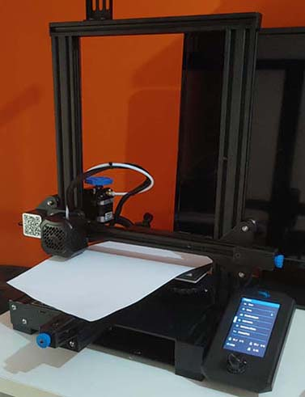
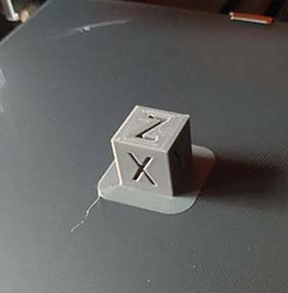
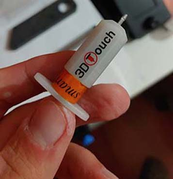
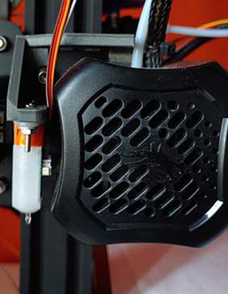
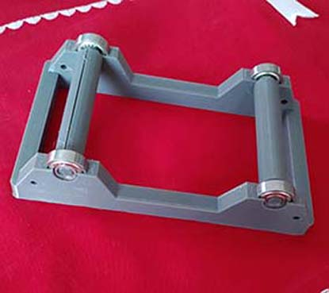
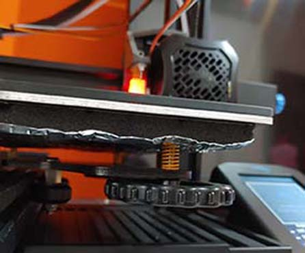

# Ender3V2
This is the repository to keep trace of the upgrade I've done to my first 3D Printer, an Ender 3 V2.
I recived the 3d printer on 6th October 2021 and I buld it stright away:

||
|-|

***
## First print
That afternoon I've decided to print the [test cube](https://www.thingiverse.com/thing:1278865) so, after the calibration of the step/mm of the extruder, and after few print used to calibrate the flow I've successfully printed the cube:

||
|-|
***
## Firmware Update
For the firmware update I've must have messed up something with th Creality Update Firmware becuse when I tryed to load the that firmware the printer didn't fully boot and even didn't show anything in the display. afterfew reserch I've found the stoc firmware and downloaded the JyesrUI firmware form my board (4.2.2) from [this link](https://github.com/jyers/marlin/releases/).
I've picked up the manual mash one.
After the firmware changes the interface showed was something like this:

||
|-|

So I was able to print and to level the bed with something that moves the PrintingHed around for me, not moving it by hand as Creality suggest.
***
## First Upgrade: Filament Guide
the fist fisical upgrade I made to my printer is actually made of 2 3d printed guide: a [roller guide](https://www.thingiverse.com/thing:3052488) and a [corner guide](https://www.thingiverse.com/thing:3015832). The first one is used to guide the filamento to the extruder while the second one in used to keep the filament from wobbling around.

|| |
|-|-|

|||
|-|-|

In this way I was able to prevent the filament from folding while entering the extruder and, the spool, from unroll itself more the needed
***

## The Spool Holder
After afew little print and some testing I decided to print a [spool roller](http://www.thingiverse.com/thing:3209211) I've found on Thingiverse. Here's some photo of the result:

|||
|-|-|

I decided to use a spool roller in bearing beacuse the spool I was using, while spinnig, was creating too much friction against the the stock holder.
It has been the first long print I've made on this machine (over 6 hours).
***

## BL-Touch
One month later I decided to ad the auto bed levelling feature to my printer so I went on Banggood and bought  a Bl-touch clone, after about one week of shepping it was mounted on my printer.
The first project was to buy also an Orbiter so i found a [designe](https://www.thingiverse.com/thing:4881107) thgat woud have suited both the bl-touch and the orbiter but afetr some dayse I decided to avoid the Orbiter so I snapped the mount to be able to mount it in an easy way.

||||
|-|-|-|
***

## Dry box, Spring & Bed insulation
The nex few upgrade I made to the printer are a dry box to keep the filament dry, harder springs because the stock bed spring are pretty weak and a bed insulation because the bed was taking so long to heat up.
The drybox is not finisced yet but I'll show you anyways how is it going:
|||
|-|-|
The installation of the harder springs and the bed insulation is pretty easy and the ammount of time I spend on waiting the bed while it heat up is considerable lower than before.
||
|-|
***

## New Printing Head
I'm planning on changing the whol printing head, replacing the stock boden extruder with a diurect drive BMG clone, the Hot-end with a genuine E3D V6 and the stock blower fan 4010 with a 4020. For doing this I had to print a new fanduct witha a body where I can attach the Hot-end and the dd BMG. Watching around on thingiverse I found a big project called [Hero Me](https://www.thingiverse.com/thing:4460970) and after  some reserch I choose to print it. This part of the Project is stil work in progres so I have only soma pics of the printed parts:

||||
|-|-|-|

***

## More Coming Soon...