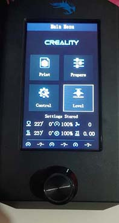
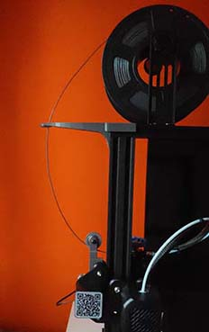

# Ender3V2
This is the repository to keep trace of the upgrade I've done to my first 3D Printer, an Ender 3 V2.
***
## Build
I recived the 3d printer on 6th October 2021 and I buld it stright away:

{:style="float: left;"}

The build was a fast-farward build 'cause the kit was pretty easy to build.
***
## First print
That afternoon I've decided to print the [test cube](https://www.thingiverse.com/thing:1278865) so, after the calibration of the step/mm of the extruder, and after few print used to calibrate the flow I've successfully printed the cube:

***
## First Firmware Update
For the firmware update I've must have messed up something with th Creality Update Firmware becuse when I tryed to load the that firmware the printer didn't fully boot and even didn't show anything in the display. afterfew reserch I've found the stoc firmware and downloaded the JyesrUI firmware form my board (4.2.2) from [this link](https://github.com/jyers/marlin/releases/).
I've picked up the manual mash one.
After the firmware changes the interface showed was something like this:

So I was able to print and to level the bed with something that moves the PrintingHed around for me, not moving it by hand as Creality suggest.
***
## First Upgrade: Filament Guide
the fist fisical upgrade I made to my printer is actually made of 2 3d printed guide: a [roller guide](https://www.thingiverse.com/thing:3052488) and a [corner guide](https://www.thingiverse.com/thing:3015832). The first one is used to guide the filamento to the extruder while the second one in used to keep the filament from wobbling around.

1.  
2.  

In this way I was able to prevent the filament from folding while entering the extruder and, the spool, from unroll itself more the needed
***

## The knife
After afew little print and some testing I decided to print a [knife](https://www.thingiverse.com/thing:4376231) I've found on Thingiverse. Here's some photo of the result:

After a few uses I found that the plate supposed to held the blade came loose, I think it's easy to fix, maybe a hole for a screw or something like that.